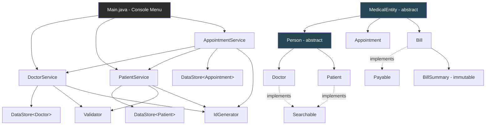

# MediTrack — Clinic & Appointment Management System

MediTrack is a modular, object-oriented Clinic & Appointment Management System built in Core Java. It models patients, doctors, appointments, and billing through a layered architecture, demonstrating core and advanced OOP concepts, exception handling, generics, and interface-based design.

## Tech Stack

- **Language:** Java 21 (LTS)
- **Build:** Standard `javac` / IntelliJ IDEA project (no external frameworks)
- **IDE used:** IntelliJ IDEA

## Project Structure

## Architecture Diagram

The diagram shows two things at once: the **runtime call flow** (`Main` → services → `DataStore`/`Validator`/`IdGenerator`), and the **class hierarchy** (`MedicalEntity` → `Person` → `Doctor`/`Patient`, plus `Appointment` and `Bill` extending `MedicalEntity` directly, and the interface implementations shown as dotted lines).

src/main/java/com/airtribe/meditrack/
├── Main.java # Console menu entry point
├── constants/
│ └── Constants.java # Tax rate, file paths
├── entity/
│ ├── MedicalEntity.java # Abstract base — id + getSummary() contract
│ ├── Person.java # Abstract — shared fields for Doctor/Patient
│ ├── Doctor.java
│ ├── Patient.java
│ ├── Appointment.java
│ ├── Bill.java
│ ├── BillSummary.java # Immutable bill snapshot
│ ├── Specialization.java # Enum
│ └── AppointmentStatus.java # Enum
├── service/
│ ├── DoctorService.java
│ ├── PatientService.java
│ └── AppointmentService.java
├── util/
│ ├── Validator.java
│ ├── IdGenerator.java
│ └── DataStore.java # Generic in-memory store
├── exception/
│ ├── InvalidDataException.java
│ └── AppointmentNotFoundException.java
├── intf/
│ ├── Payable.java
│ └── Searchable.java
└── test/
└── TestRunner.java

docs/
├── JVM_Report.md
├── Setup_Instructions.md
└── Design_Decisions.md

## Features

### Core Functionality
- **Doctor & Patient Management** — Register, search (by ID / name / age / specialization), delete
- **Appointment Booking** — Book, view, cancel appointments between registered doctors and patients
- **Billing** — Generate a bill for a completed appointment, with automatic tax calculation and an immutable `BillSummary`

### OOP Concepts Demonstrated
- **Encapsulation** — Private fields with public getters/setters across all entities; centralized validation via `Validator`
- **Inheritance** — `MedicalEntity` → `Person` → `Doctor` / `Patient`; constructor chaining via `super()`
- **Polymorphism** — Overridden `displayInfo()` and `getSummary()` per subclass; dynamic dispatch demonstrated at runtime
- **Abstraction** — Abstract classes (`MedicalEntity`, `Person`) and interfaces (`Payable`, `Searchable`) with default methods
- **Immutability** — `BillSummary` — `final` class, `final` fields, no setters
- **Cloning** — `Patient` and `Appointment` implement `Cloneable`; `Appointment.clone()` performs a true deep copy of its nested `Doctor` and `Patient` references
- **Enums** — `Specialization`, `AppointmentStatus` replace raw strings for fixed categories
- **Generics** — `DataStore<T>` provides type-safe, reusable storage for any entity type
- **Custom Exceptions** — `InvalidDataException`, `AppointmentNotFoundException` (both checked)

## How to Run

1. **Prerequisites:** JDK 21 installed (see `docs/Setup_Instructions.md`)
2. Clone the repository:

git clone https://github.com/Shanki21/meditrack.git

3. Open the project in IntelliJ IDEA (or any IDE), ensure the Project SDK is set to Java 21
4. Run `Main.java`

