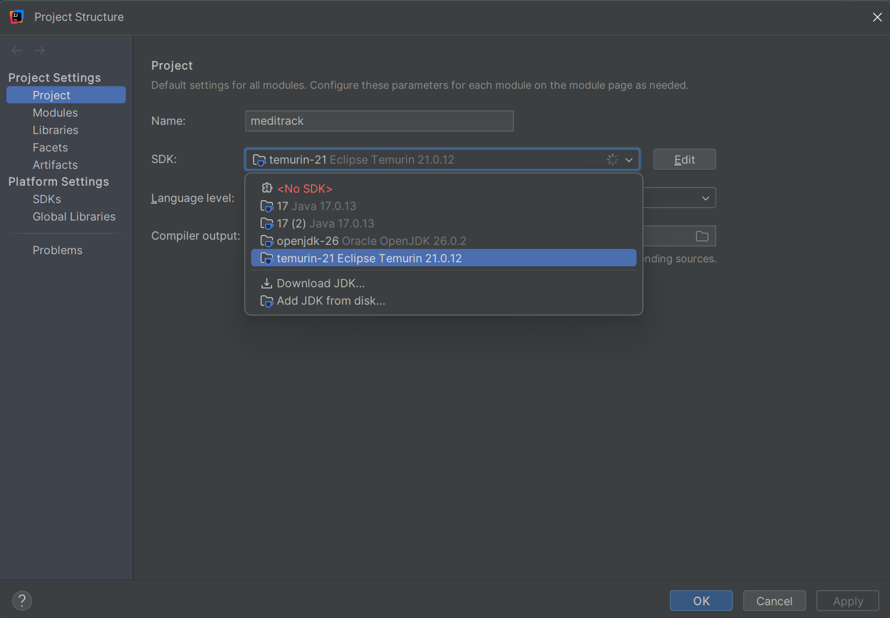
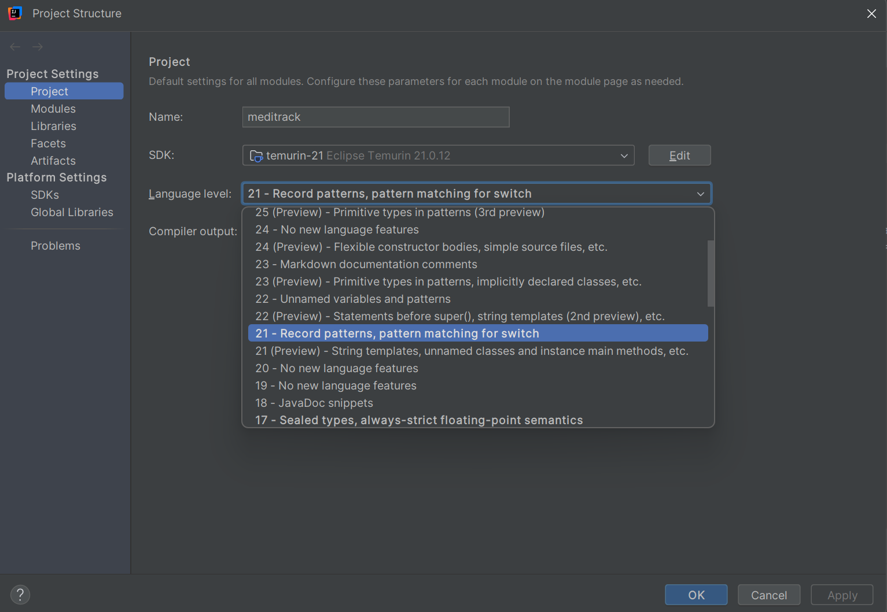

# Setup Instructions — MediTrack

This document covers how to install and configure the Java environment used to build and run MediTrack.

## 1. Prerequisites

- **JDK Version:** 21 (LTS)
- **IDE:** IntelliJ IDEA (Community or Ultimate)

JDK 21 was chosen over newer non-LTS releases (e.g., JDK 26) because it is a **Long-Term Support** release, meaning it receives updates and support for several years — the same version most production Java systems and companies actually run. This makes it the more realistic choice for a project meant to reflect real-world development practices.

## 2. Installing the JDK via IntelliJ

1. Open IntelliJ IDEA and go to **File → Project Structure → Project**.
2. Under **SDK**, click the dropdown → **Add SDK → Download JDK**.
3. Select **version 21**, vendor **Eclipse Temurin** (or Amazon Corretto).
4. Click **Download**.

*(screenshot: Project Structure dialog showing SDK set to `temurin-21`)*

## 3. Setting the Language Level

1. In the same **Project Structure** dialog, set **Language level** to the stable (non-preview) JDK 21 option — e.g., *"21 - Record patterns, pattern matching for switch"*.
2. Avoid any option labeled **"(Preview)"** — preview features are not part of the stable language spec and require special compiler flags to run outside the IDE.

*(screenshot: Language level dropdown set to 21, non-preview)*

## 4. Verifying the Installation

Open IntelliJ's own terminal (Alt+F12) and run: 

java -version

Expected output should show something like:

openjdk version "21.0.12" ...

> Note: A system-wide terminal outside the IDE may show a different JDK version if multiple JDKs are installed on the machine. What matters for this project is that the **IntelliJ Project SDK** is set to 21, which controls compilation and execution regardless of the system PATH default.

## 5. Project Package Structure Setup

Inside `src/main/java`, right-click and create the following packages under `com.airtribe.meditrack`:

entity
service
util
exception
intf
constants
test

> Note: The package is named `intf` rather than the reserved keyword `interface`, since `interface` cannot be used as a Java package or identifier name.

## 6. Running the Project

1. Locate `Main.java` inside `com.airtribe.meditrack`.
2. Right-click → **Run 'Main.main()'**.
3. The console menu should appear, confirming the environment is correctly configured.

*(screenshot: Successful run showing the MediTrack menu in the console)*

